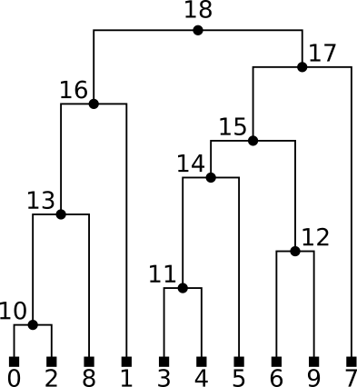

## Trees with SQL

Aim of this post: 
* Introduction to ORM (object relational mapping): using ORM, Python objects can be mapped to table
format to be stored inside an SQL database (and back).
* Demonstrate how can we use a (sql) database to encode and traverse a binary tree.

### The tree format.
We will be using the *tskit* library encoding to provide an existing object-oriented
Python API to interact with binary trees. This cool library can do much more sophisticated stuff.
Go check it out if you're interested in genetics and/or graphs: [*tskit*](tskit.dev).

Any tree can be encoded by describing the relations between the edges and nodes. For this example
we will be using the following tree,
which can be generated using this code snippet:

```python

import msprime
import tskit

# generate a random binary tree
recombination_rate = 0.0
ts = msprime.sim_ancestry(
    5, 
    recombination_rate=recombination_rate, 
    sequence_length=10, 
    random_seed=42
)
ts.draw_svg()

<p align="center">
  
</p>


### ORM

Object relational mapping is a technique that allows you to interact with a relational database using
an object oriented approach with languages like Python.
Here I'll stick to the basics using *sqlite3* and extend some ideas introduced in
[this blogpost](https://medium.com/@joeylee08/object-relational-mapping-from-python-to-sql-and-back-cd629eca0060) by Joseph Lee.

The first bit of code is needed to establish a connection (and create) a sql database. Let's make abstraction of how
this works for now. In the subsequent code snippets you'll find that we use the `CURSOR`
to execute SQL-command, and `CONN` to ensure that the consequence of running a particular command is stored within
the database.

```python
import sqlite3 as sql
import dataclasses

#sqlite3 has a connect() method which accepts a .db file as a destination
CONN = sql.connect('ts.db')
#once we establish our connection and assign it to CONN, we create a CURSOR
CURSOR = CONN.cursor()
#this CURSOR object contains all the methods we will need for our ORM tasks
```

To encode the edges and nodes in the example tree we will generate a database containing
a table for the nodes as well as a table for the edges. The rows in the edge table will
have the following structure: (id, left, right, parent, child). Here, both parent and child
are nodes in the tree which thus will occur in the nodes table. Each row in the nodes table
will have the following entries: (id, flags, time). The flags is a simple boolean indicating
whether a node is a leaf (`True`) or not (`False`).

The following code creates a class for both nodes and edges and allows us to not only create
a table in the database for such class, but more importantly translate each such object into
a corresponding entry in the correct table. Note that the `create_table` method for the `Edge`
class has the following sql-specifier: `FOREIGN KEY (parent)`. This generates the "relational"
part of the relational database that we will be generating. More specifically, this indicates
that both the `parent` and `child` column will always correspond to the `PRIMARY KEY`, or unique
identifier of a node in the nodes table.

```python
@dataclasses.dataclass
class Edge:
    
    id: int
    left: float
    right: float
    parent: int
    child: int
    
    @classmethod 
    def create_table(cls):
        #use the triple quotes """ syntax to construct a SQL query
        sql = """
            CREATE TABLE IF NOT EXISTS edges (
            id INTEGER PRIMARY KEY,
            left FLOAT,
            right FLOAT,
            parent INTEGER,
            child INTEGER,
            FOREIGN KEY (parent)
                REFERENCES nodes (id)
            FOREIGN KEY (child)
                REFERENCES nodes (id));
        """
        #call CURSOR.execute and pass in our SQL query
        CURSOR.execute(sql)
        #finally, fire off the database request
        CONN.commit()

    @classmethod
    def drop_table(cls):
        #construct another SQL query to drop tables
        sql = """   
            DROP TABLE IF EXISTS edges;
        """
        CURSOR.execute(sql)
        CONN.commit()
        
    #our save() method will be called on an instance to create a SQL query
    def save(self):

        #construct a SQL query that references the database column names
        sql = """
            INSERT INTO edges (id, left, right, parent, child)
            VALUES (?, ?, ?, ?, ?);
        """

        #CURSOR.execute() will execute our SQL query with the desired values
        CURSOR.execute(sql, (self.id, self.left, self.right, self.parent, self.child))
        
        #this will fire off the SQL query using CONN.commit()
        CONN.commit()

    
    #class method create() will instantiate an object and save() it to our database
    @classmethod
    def create(cls, id, left, right, parent, child):

        #we then call the cls constructor [Edges] and pass in those values
        new_instance = cls(id, left, right, parent, child)

        #our instance method save() is what actually will query the database
        new_instance.save()

        #we return the created object so it can be used elsewhere in our code
        return new_instance

    
@dataclasses.dataclass
class Node:
    
    id: int
    flags: int
    time: float
    
    @classmethod 
    def create_table(cls):
        #use the triple quotes """ syntax to construct a SQL query
        sql = """
            CREATE TABLE IF NOT EXISTS nodes (
            id INTEGER PRIMARY KEY,
            flags INTEGER,
            time FLOAT);
        """
        #call CURSOR.execute and pass in our SQL query
        CURSOR.execute(sql)
        #finally, fire off the database request
        CONN.commit()

    @classmethod
    def drop_table(cls):
        #construct another SQL query to drop tables
        sql = """   
            DROP TABLE IF EXISTS nodes;
        """
        CURSOR.execute(sql)
        CONN.commit()
        
    #our save() method will be called on an instance to create a SQL query
    def save(self):

        #construct a SQL query that references the database column names
        sql = """
            INSERT INTO nodes (id, flags, time)
            VALUES (?, ?, ?);
        """

        #CURSOR.execute() will execute our SQL query with the desired values
        CURSOR.execute(sql, (self.id, self.flags, self.time))
        
        #this will fire off the SQL query using CONN.commit()
        CONN.commit()
        
    
    #class method create() will instantiate an object and save() it to our database
    @classmethod
    def create(cls, id, flags, time):

        #we then call the cls constructor [Pet] and pass in those values
        new_instance = cls(id, flags, time)

        #our instance method save() is what actually will query the database
        new_instance.save()

        #we return the created object so it can be used elsewhere in our code
        return new_instance
```
Now that we've done all this preperation work, we can actually create our database
using the information from the tree we generated earlier.

```python

Node.create_table()
Edge.create_table()

for node in ts.nodes():
    # create node(id, flags, time)
    Node.create(node.id, node.flags, node.time)

for edge in ts.edges():
    # create edge(id, left, right, parent, child)
    Edge.create(edge.id, edge.left, edge.right, edge.parent, edge.child)
```

